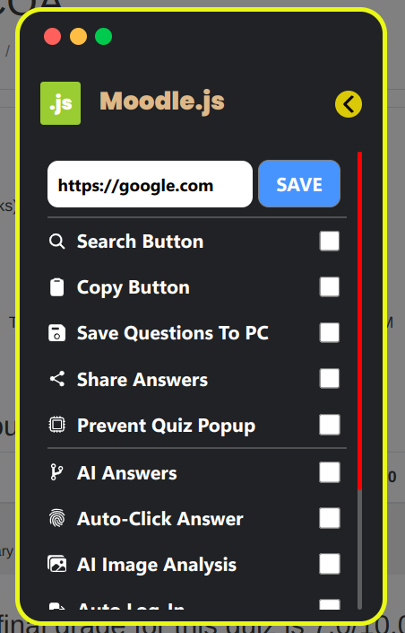

## KIIT Moodle Plugin 🎲
 Plugins support for KIIT moodle to optimize your performance.

 ☢️ **DESCLAIMER:** Cheating is bad like really. This project doesn's support cheating nor cheaters 🫵. It merely exists to show common vulnerabilities and flaw in moodle, for experimenting purpose and as my scripting practice. This script is provided "as is" without any warranties, express or implied. The author takes no responsibility for any consequences resulting from the use of this script. Use it at your own risk. It is recommended to test this script in a review mode and not on a real test/quizzes. By using this script, you acknowledge that you understand and agree to this disclaimer. 💯

 ### 📸 Screenshot?

    
     
    The minority of the fancy features are not functioning properly, and this is more accurately detailed in the TODO section below 👇

---

 ### 🤌 Installation:
 1. **Install a userscript-manager** (*any one*)

    -  [Tampermonkey](https://chrome.google.com/webstore/detail/tampermonkey/dhdgffkkebhmkfjojejmpbldmpobfkfo) or
    -  [Tampermonkey](https://addons.mozilla.org/firefox/addon/tampermonkey/) or
    -  [Tampermonkey](https://microsoftedge.microsoft.com/addons/detail/tampermonkey/dhhkcnkncnogfoefnondnaogonpedlnh) or
    -  [Tampermonkey](https://apps.apple.com/app/tampermonkey/id1482490089) or
    -  [Tampermonkey](https://addons.opera.com/extensions/details/tampermonkey-beta/)

    > I recommend using tampermonkey to prevent any api issues (*untested*).

2. **And install the script** (*from any one*)
    -  [Greasyfork.org](https://greasyfork.org/en/scripts/485024-kiit-moodle) or

    -  [Github](https://github.com/rohitaryal/kiit-moodle-plugin/raw/main/kiit-moodle-plugin.user.js)

3. **(Optional)** If you want to check the script performance then goto [KiitMoodle.in](https://kiitmoodle.in/). Open your past test exams(in review mode) and you will see a setting icon at top right of your moodle page 👍

### 🐥 How to use?
1. Follow the procedure provided to install the script.
2. Upon completion of the installation, go to [KiitMoodle.in](https://kiitmoodle.in/).
3. Ensure that you are logged in to your account.
4. Look for the 'setting' icon located at the top right corner.
5. Check the necessary options before getting started, especially if it's your first time using the script.
6. Access your previous quizzes in review mode.
7. That's it, you have completed the process.

**NOTE:** Please don't check the 'Prevent Quiz Popup' during your real test (hell don't even use this script in real test)

---

### 🔫 Features:
- Personalized search engine
- Easily copy questions along with options with just one click
- Save questions to your computer for later use
- Access AI-generated answers using the Gemini API
- Quickly toggle the hide and unhide feature

📣 **TODO**:
- Fix the debugger
- Complete image analysis
- Fix the un/hide buttons
- Complete autoclick answers
- Complete share answers feature
- Remove 'prevent quiz popup' for new quiz

### 🐛 Doesn't work?

Please submit an issue and make sure to paste the console logs with it. A detailed step for viewing console logs/errors is [given here](https://documentation.concretecms.org/tutorials/how-open-browser-console-view-errors).

---
*In case of bugs and errors please please please submit an issue :)*